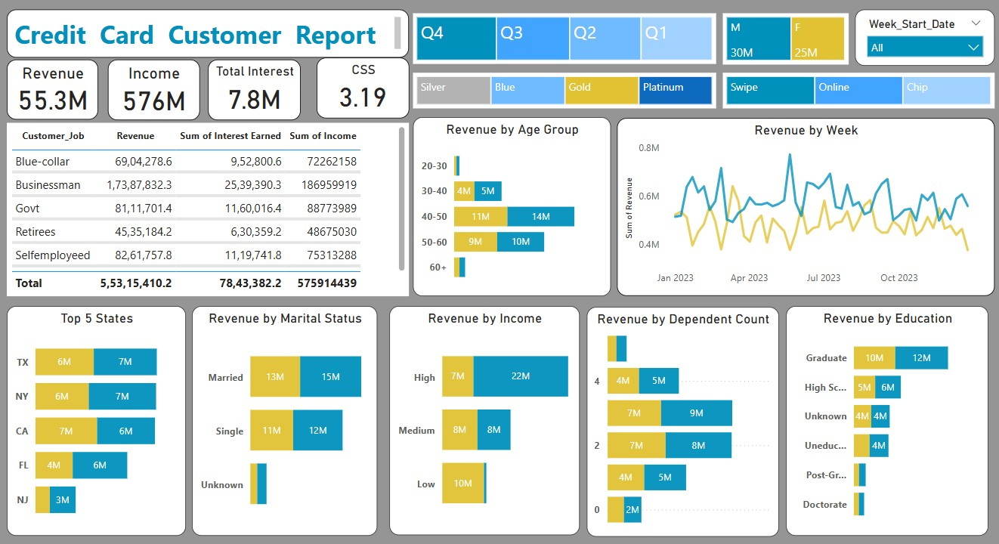

# Credit-Card-Report-Analysis-
To develop a comprehensive credit card weekly dashboard that provides real-time insights into key performance metrics and trends, enabling stakeholders to monitor and analyze credit card operations effectively.

---

##  Tools & Technologies Used
- **Microsoft SQL Server** – Data storage, cleaning, and querying
- **Power BI** – Data visualization and dashboard creation
- **DAX (Data Analysis Expressions)** – Custom calculations and measures
- **CSV** – Source data format

---

##  Data Processing Strategy

- Data was first imported from **CSV into SQL Server**.
- **Data cleaning** was done at the SQL level for better performance in Power BI.
  - Removed null values and duplicates.
  - Bucketed values like age and income into logical groups for better visuals.
- Data was then imported into Power BI from SQL Server.

###  Data Transformation in SQL
- Pre-cleaning before Power BI import
- Ensured consistent datatypes, handled missing data

---

##  DAX Calculations

###  Age Group Column:
```DAX
AgeGroup = SWITCH(
    TRUE(), 
    cust_detail[Customer_Age] < 30, "20-30",
    cust_detail[Customer_Age] >= 30 && cust_detail[Customer_Age] < 40 , "30-40",
    cust_detail[Customer_Age] >= 40 && cust_detail[Customer_Age] < 50 , "40-50",
    cust_detail[Customer_Age] >= 50 && cust_detail[Customer_Age] < 60 , "50-60",
    cust_detail[Customer_Age] >= 60, "60+",
    "unknown"
)
```

Income Grouping:
```DAX
IncomeGroup = SWITCH(
    TRUE(), 
    cust_detail[Income] < 35000, "Low",
    cust_detail[Income] >= 35000 && cust_detail[Income] < 70000, "Medium",
    cust_detail[Income] >= 70000, "High",
    "Unknown"
)
```

Week-on-Week Revenue Tracking:
```DAX
Currrent_Week_Revenue = 
CALCULATE(
    SUM(cc_detail[Revenue]),
    FILTER(ALL(cc_detail), cc_detail[week_num2] = MAX(cc_detail[week_num2]))
)

Previous_Week_Revenue = 
CALCULATE(
    SUM(cc_detail[Revenue]),
    FILTER(ALL(cc_detail), cc_detail[week_num2] = MAX(cc_detail[week_num2]) - 1)
)

WOW_Revenue = 
DIVIDE([Currrent_Week_Revenue] - [Previous_Week_Revenue], [Previous_Week_Revenue])
```

----

### Dashboard and Visuals 
1. Credit Card Transaction Dashboard
 KPIs:
 - Revenue: ₹55.3M
 - Amount: ₹44.5M
 - Total Interest Earned: ₹7.8M
 - Transaction Count: 655.7K

 Key Visuals:
 - Revenue by Expenditure Type
 - Revenue by Chip Usage
 - Revenue by Card Category
 - Revenue by Education, Job, and Age Group
 - Qtr-wise Revenue & Transaction Count
 - Week-on-Week trend line
 - Filters: Gender, Income Group, Card Type, Quarter

 Screenshot: 

 2. Credit Card Customer Dashboard
 KPIs:
 - Revenue: ₹55.3M
 - Total Income: ₹576M
 - Total Interest: ₹7.8M
 - Customer Spending Score (CSS): 3.19

 Key Visuals:
 - Revenue by Age Group
 - Revenue by State, Income, Education, Marital Status, Dependents
 - Weekly Revenue Line Chart
 - Revenue by Customer Job
 - Filters: Gender, Card Type, Income Group, Quarter, Week

 Screenshot: 

---

### Year-To-Date (YTD) Performance Summary
 - Overall revenue: ₹57M
 - Total interest earned: ₹8M
 - Total transaction amount: ₹46M
 - Male customers contribute ₹31M in revenue vs. ₹26M from females
 - Blue & Silver cardholders account for 93% of transactions
 - Top states (TX, NY, CA) contribute 68% of overall revenue
 - Overall activation rate: 57.5%
 - Overall delinquency rate: 6.06%

---

### Project Insights
## Transaction Insights:
- Blue Card users generate the highest revenue (₹46M).
- Swipe transactions dominate usage (₹35M vs ₹17M Chip).
- Q1 & Q3 are peak quarters for revenue and transactions.
- High spending categories: Bills, Entertainment, Fuel.
- Week-on-Week Revenue tracking provides real-time business trend analysis.

## Customer Insights
- Businessmen are the most profitable segment (₹17.3M revenue).
- Customers aged 40-50 contribute the most revenue.
- Higher income groups and married customers drive spending.
- Texas, NY, CA lead in income and revenue.
- More dependents correlate with higher revenue.

---
Graduates and Postgraduates are top contributors to revenue.


